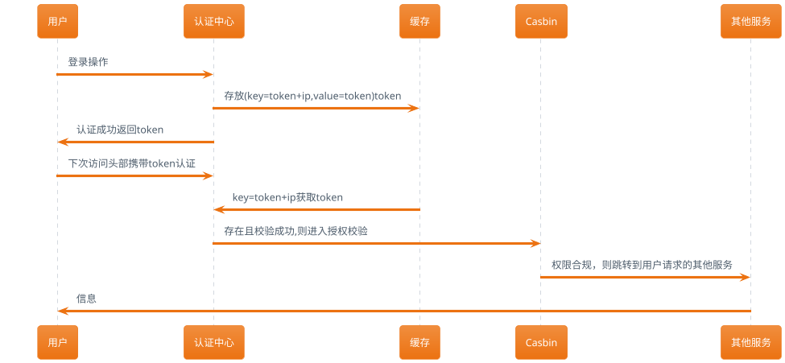

{}
项目一般都要包含权限管理功能，或集成IAM，或自身实现。本文介绍一个强大、高效的开源访问控制框架--Casbin。
{}

## 基本介绍

Casbin的由来，是出自开源作者`罗杨`的一篇论文[《PML：一种基于Interpreter的Web服务访问控制策略语言》](https://arxiv.org/abs/1903.09756)，该论文的主要摘要如下：

> 为了保护云资源的安全,防止数据泄露和非授权访问,必须对云平台的资源访问实施访问控制.然而,目前主流云平台通常采用自己的安全策略语言和访问控制机制,从而造成两个问题:
> - （1）云用户若要使用多个云平台,则需要学习不同的策略语言,分别编写安全策略;
> - （2）云服务提供商需要自行设计符合自己平台的安全策略语言及访问控制机制,开发成本较高.
> 
> 对此,提出一种基于元模型的访问控制策略描述语言PML及其实施机制PML-EM. PML支持表达BLP、RBAC、ABAC等访问控制模型.
> PML-EM实现了3个性质:
> - 策略语言无关性
> - 访问控制模型无关性
> - 程序设计语言无关性
> 
> 从而降低了用户编写策略的成本与云服务提供商开发访问控制机制的成本. 在OpenStack云平台上实现了PML-EM机制.实验结果表明,PML策略支持从其他策略进行自动转换,
> 在表达云中多租户场景时具有优势.性能方面,与OpenStack原有策略相比,PML策略的评估开销为4.8%.PML-EM机制的侵入性较小,与云平台原有代码相比增加约0.42%. 


目前Casbin的权限策略管理支持主流的**ACL、RBAC、ABAC**、RESTful等模型，实现的编程语言主要有Go、java、Nodejs、PHP、Python、.Net、C++、Rust等。目前Go和Java的实现最为全面。

先介绍下主流的访问控制模型：
- _ACL（access control list）_：是一种与访问对象关联的权限列表，在基础设施领域应用非常广泛：
  - 文件系统：用户（组）对文件或进程等的访问权限控制
  - 网络：常见的有防火墙（安全组、路由器、交换机）内的对目的IP和端口的规则控制
  - SQL：库、表的权限管理
  - [LDAP](../openldap之拨云去日)：层级结构的实体权限管理：网络域权限管理...
- _RBAC（role-based access control）_：基于角色的权限控制，围绕角色和权限定义的策略中立的访问控制机制，和组ACL等价，具体表现为在用户和权限之间加了一层角色，先建立具有某种权限的角色，然后用角色和用户绑定，目前多用于业务系统内的权限管理，还支持支持角色权限继承。
- _ABAC（Attribute-based access control）_：基于属性的权限控制，属性可以是用户侧（所属组织、访问IP、访问时间）或资源侧（帖子的评论开关、留言再编辑）的，因为用户或资源的属性是动态的，不像前面两个(需要预先定义好策略，略显死板,,,）被称为是“下一代”的权限模型。
- _Restful_：一种Web API规范，常用GET, POST等动作来实现与后台交互。

和Casbin结合，使用的基本示意图如下：


- 1-2为管理人员下发权限策略
- 3-6为用户日常操作资源的简易流程，实际应用场景一般如下：




## 抽象模型

正如上面提到的，要支持这么多的权限模型，，所以Casbin基于开头提到的PML（PERM modeling language）引入一种抽象的元模型控制，其中**PERM**是指的**Policy, Effect, Request, Matchers**，具体工作流如下：


这里的`PERM`是Casbin在启动时要加载的抽象校验模型，可以理解成一种权限校验模板。 简单说个场景串下这里的概念：

- 管理员分配给用户权限**Policy**，可以得到`谁能操作什么资源`的信息
- 用户发起请求**Request**，可以得到`谁要操作什么资源`的信息
- Casbin拿到Request和Policy做匹配**Matcher**，也支持自定义函数匹配。
- 根据匹配结果**Effect**来决定是否允许用户的操作

实际场景中，用户可能被分配了多个权限（角色），那具体权限校验如下：


既然是一种语言，就是有语法的，[PERM语法](https://casbin.org/docs/zh-CN/syntax-for-models)至少要有四部分：`[request_definition], [policy_definition], [policy_effect], [matchers]`。
具体就不展开介绍了，可自行官网祥读，effect部分具备SQL背景可能好理些,,,理解不了也没关系，目前就内置了5种：
Effect | 含义 | 样例
----|------|----
some(where (p.eft == allow)) | allow-override | [ACL, RBAC, etc.](https://casbin.org/docs/zh-CN/supported-models#examples)
!some(where (p.eft == deny)) | deny-override | [Deny-override](https://casbin.org/docs/zh-CN/supported-models#examples)
some(where (p.eft == allow)) && !some(where (p.eft == deny)) | allow-and-deny | [Allow-and-deny](https://casbin.org/docs/zh-CN/supported-models#examples)
priority(p.eft) &#124;&#124; deny | priority | [Priority](https://casbin.org/docs/zh-CN/supported-models#examples)
subjectPriority(p.eft) | priority base on role | [Subject-Priority](https://casbin.org/docs/zh-CN/supported-models#examples) 

> 奉劝各位看官，既然是语法，就不要纠结里面的命名和写法，较真...人家就是这么定义的，知道能都有哪些写法就可以了...，实际使用中往往改动Macter的部分概率大些。

## 按场景举例

### ACL模型

先定义Casbin要加载的PERM Model，我使用在线编辑器定义一个[ACL典型模型](https://casbin.org/casbin-editor/#6TQQJ8EQF):


解读如下：
- 左上侧为Casbin启动时要加载的标准ACL Model配置，不需要改动
- 右上侧为Policy部分，属于管理员要分配权限时要改动的部分：示例中定义了5条规则，小王和小李对自己的Home目录可以读写，而小李额外可以读取小王的Home目录
- 左下角Request表明用户的请求，一般是从用户实际发起的请求中获取信息，组合好格式后，用API发起校验，示例中小李发起读和写小王的操作
- 右下角为权限校验结果：示例中小李的写操作被拒绝了

### RBAC模型

下图模式的在线[编辑地址](https://casbin.org/casbin-editor/#F8A6D8YHE)


Macters里的`g(r.sub, p.sub, r.dom)` 将检查用户 r.sub 在域内 r.dom 是否具有角色 p.sub ，这是该匹配器的工作方式。


### ABAC模型

上图中RBAC中的Matcher如下修改，及实现了ABAC的模型校验。表明用户必须是要访问资源的`Owner`才可以操作符合角色权限内的资源。

```Conf
m = r.obj.Owner == r.sub && (g(r.sub, p.sub, r.dom) && r.dom == p.dom && r.obj == p.obj && r.act == p.act)
```

## 总结

Casbin提供了非常灵活的权限校验模型，还提供了丰富的API，方便更便捷的实现业务场景功能, 后面会针对具体的项目开展更贴地气的解读。

## 参考
> https://casbin.org/docs/zh-CN/tutorials

> 我的博客即将同步至腾讯云+社区，邀请大家一同入驻：https://cloud.tencent.com/developer/support-plan?invite_code=3ntkskjrcwow8