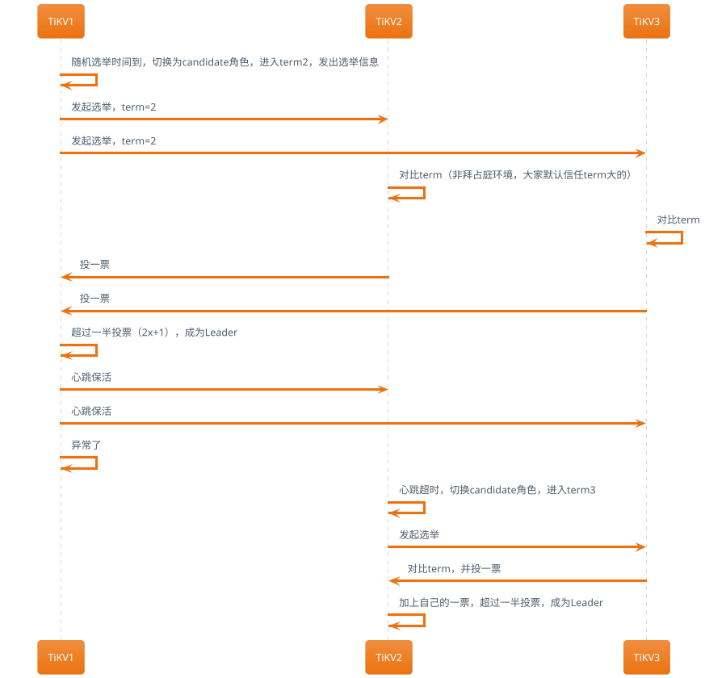
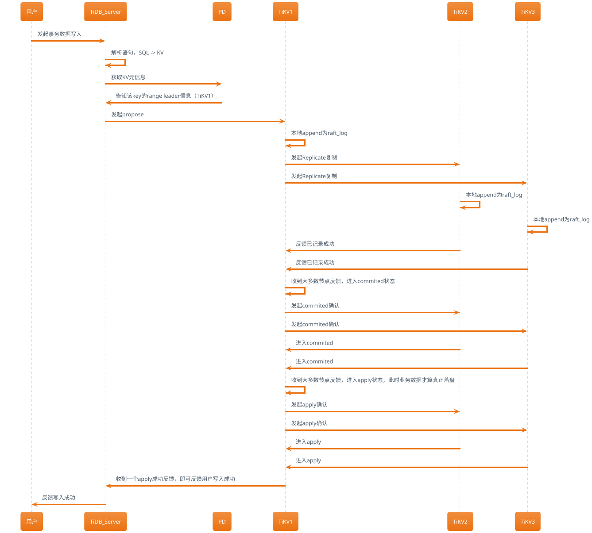

## 安装

> 安装环境要求：
> - Mac或者单机Linux环境
> - 可以连接外网

1. 执行命令安装`TiUP`工具，官方运维管理工具。

```bash
curl --proto '=https' --tlsv1.2 -sSf https://tiup-mirrors.pingcap.com/install.sh | sh
```

命令会有关键信息输出:添加了证书、修改了PATH变量等，需要声明下环境变量，以使`tiup`命令能被找到。

2. 声明系统环境变量

```bash
# 因个人环境，此处会有差异
source ~/.zshrc
```

可以`echo $PATH`下，看到`/root/.tiup/bin`被加到了最前面。


3. 启动单实例集群

直接执行`tiup playground`命令默认会运行最新版本的TiDB集群，其中TiDB Server、TiKV、PD 和 TiFlash 实例各 1 个：
```bash
tiup playground
```

具体如下图所示，需要另开一个终端，使用mysql发起连接：


目前tidb playground默认启动监听在127的地址，可以通过--host参数更改，但还不能更改端口（经查代码是写死了端口）。

- 其他可修改参数，可通过`tiup playground -h`查看。
- dashboard的默认root用户没有密码，如果是公网暴露了，建议如下添加密码(我这里设置了root密码为`tidb`):
```bash
mysql -h127.0.0.1 -P4000 -uroot
alter user 'root' identified by 'tidb';
```
- grafana的登录密码，默认为admin/admin
- `tiup update --self`可升级tiup命令

> mysql客户端可通过`yum install -y mysql`或者`apt install mysql-client`安装。

## 集群

没有多节点的环境，折腾了一下，要单机玩这个模式的话，需要hack的东西太多，，，目前还不建议这么搞，等有时间看能不能提个PR.

## TIDB Server

处理client的SQL请求.

## PD

提供全局时钟和Region调度和管理（扩缩容）。

## TIKV

使用rocksDB实现数据持久化，基于此实现了分布式存储引擎，其中的核心点可以理解为以下三点：

- 事务
- MVCC
- Raft

### 分布式事务Percolator 
基于时间戳的两阶段提交事务解决方案。

### MVCC多版本并发控制

`COW`的本质。默认revision大的为最新值，

### 多副本Raft一致性

**Leader选举：**

- `Term`状态变化，follower -> (random timeout) -> candidate -> leader. 此过程因为网络延迟问题，很可能是进行多轮选举。



> leader负责读写请求，follower负责数据多副本复制。日常心跳保活，出问题后，重新选举。

**数据写入**：

- propose -> append (local) -> Replicate (remote append) -> commited -> apply



> SQL事务的commit对应到这里的apply，这里的commited是指raft中记录上用户的数据更新了（多数据节点记录上用户的写入请求了）。

**数据读取：**

- tidb server解析SQL语句 -> 从pd获取对应key的tikv节点信息 -> 

